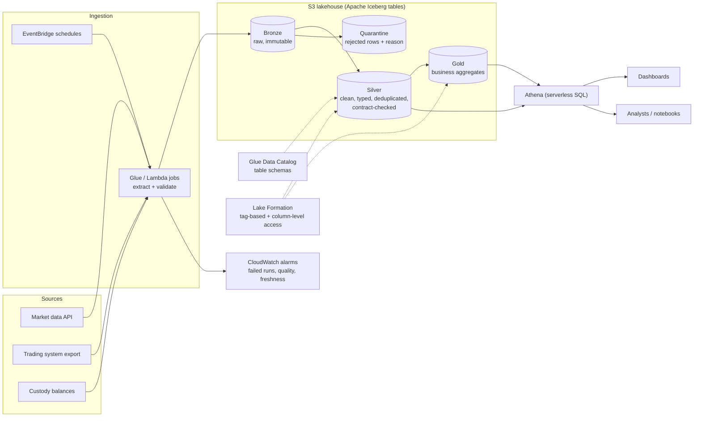
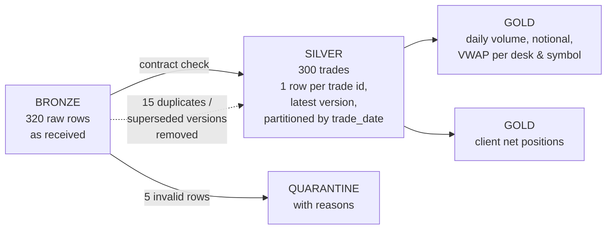

# Architecture: Cloud Data Platform for a Digital-Asset Trading Desk

> A reference design for a **lakehouse** on AWS that brings together a trading desk's market data, trades and custody balances, so traders, risk and finance work from **one governed source of truth**. It includes a small working version of the core pipeline (bronze → silver → gold with a data contract) and a query-cost model. All data is synthetic.

## 1. Context

| Source | Example | Frequency |
|---|---|---|
| Market data | Exchange candles (as in this portfolio's crypto data pipeline) | Minutes–hourly |
| Trades | Trading/OMS export: trade id, desk, symbol, side, quantity, price, client | Intraday batches |
| Custody balances | Hot/warm/cold wallet balances (as in the custody architecture project) | Hourly |
| Reference data | Clients, instruments, desks | On change |

**Consumers:** daily P&L and volume dashboards, risk (client net positions, exposure limits), finance reconciliation, compliance look-backs, and analysts running ad-hoc SQL.

**Key requirements:** one consistent version of each number; full history and replay; client data visible only to those who need it; low running cost at modest scale; no servers to manage.

## 2. Architecture overview

## 3. The medallion layers

The counts are from the bundled synthetic run (`python -m lakehouse run`).

| Layer | Rule | Why |
|---|---|---|
| **Bronze** | Store exactly what arrived, never edit | Replay and audit: any bug downstream can be fixed and reprocessed |
| **Silver** | Enforce the **data contract** (types, allowed values, patterns, required fields); normalise (e.g. `btcusdt` → `BTCUSDT`, two timestamp formats → UTC ISO); keep the **latest version** per trade id; partition by trade date | One trustworthy, queryable copy of each record |
| **Quarantine** | Rows that break the contract, with the reason | Bad data is visible and fixable at the source, never silently dropped |
| **Gold** | Aggregates shaped for use: daily desk/symbol volume, notional and VWAP; client net positions | Fast, cheap dashboards; everyone uses the same definitions |

## 4. Governance

- **Data contracts** ([`contracts/trades.json`](contracts/trades.json)): owner, primary key, partitioning, freshness promise, and per-column rules. Producer and consumers agree on it, and the pipeline enforces it on every row.
- **Classification:** columns are tagged (e.g. `client_id` = *confidential*). With **Lake Formation tag-based access control**, analysts can query trade volumes but only risk and compliance roles see client identifiers (column-level permissions).
- **Lineage:** bronze file → silver partition → gold table, recorded per run together with the quality report (`quality_report.json`: rows in, quarantined, deduplicated, partitions written).
- **Retention:** bronze kept for the regulatory look-back period; silver and gold can be rebuilt from bronze.

## 5. Architecture Decision Records

### ADR-001: Lakehouse on S3 with an open table format, not a traditional warehouse
- **Options:** (a) data warehouse (e.g. Redshift, Snowflake); (b) S3 data lake with plain files; (c) S3 lakehouse with Apache Iceberg tables.
- **Decision:** (c).
- **Why:** Cheap durable storage, no lock-in to one engine (Athena, Spark and others read Iceberg), plus warehouse-like features plain files lack: safe updates and deletes, schema evolution, and time travel to see a table as it was.
- **Revisit:** if many concurrent heavy BI users need consistently low latency, add a warehouse on top of gold.

### ADR-002: Medallion layers with quarantine
- **Why:** Separates "what we received" from "what we trust" from "what the business uses". Each layer has one job and can be rebuilt from the one before.

### ADR-003: Data contracts enforced at silver
- **Why:** Most data incidents come from upstream changes nobody announced. A written, versioned contract makes the expectations explicit and turns violations into quarantined rows with reasons, not broken dashboards.

### ADR-004: Partition by trade date; store as Parquet (via Iceberg)
- **Why:** Most questions are about recent days. With date partitions and a columnar format, a query reads only the days and columns it needs. The cost model in §7 shows the effect. (The local demo writes CSV partitions to stay dependency-free. The platform would write Parquet.)

### ADR-005: Serverless first: Athena, Glue, EventBridge
- **Why:** No clusters to size or patch, and you pay per use, which suits modest and spiky workloads. The trade-off is less control over query performance than a dedicated warehouse or cluster.

### ADR-006: Idempotent, partition-overwrite processing
- **Why:** Re-running a day after a fix gives exactly the same result with no duplicates. The demo rewrites its silver partitions on every run, and the tests check that two runs give identical output.

## 6. Risk register

| ID | Risk | Likelihood | Impact | Mitigation |
|---|---|---|---|---|
| R-01 | Source changes format without notice | Medium | High | Data contract; quarantine with alerting; contract versioning with producers |
| R-02 | Amended trades double-counted | Medium | High | Primary key + latest-version rule in silver (tested) |
| R-03 | Client identifiers exposed to too many users | Medium | High | Column classification; Lake Formation column-level permissions; access reviews |
| R-04 | Runaway query costs (full scans) | Medium | Medium | Partitioning and Parquet; Athena workgroup per-query data limits; cost alerts |
| R-05 | Stale data shown as current | Medium | Medium | Freshness promise in contract; freshness alarm; "as of" timestamp on dashboards |
| R-06 | Gold definitions diverge between teams | Medium | Medium | Single gold layer owned by the data team; documented metric definitions |
| R-07 | Bronze deleted or corrupted | Low | High | S3 versioning and Object Lock on bronze; replication to a second region for critical data |

## 7. Cost model

### Why layout matters: query cost on Athena

Athena charges by data scanned: about **$5 per TB** in us-east-1 (approximate, check current pricing), with a 10 MB minimum per query. `python -m lakehouse cost` compares layouts for **500 GB of raw trade data**, **1,000 queries a month**, each reading **4 of 20 columns** for **the last 7 days** of a year. It assumes **4× compression** for Parquet versus CSV, which is an assumption to vary, not a measurement:

| Layout | Per query | Per month |
|---|---:|---:|
| CSV, no partitions | $2.44 | $2,441 |
| CSV, partitioned by date | $0.047 | $47 |
| Parquet, no partitions | $0.12 | $122 |
| **Parquet, partitioned by date** | **$0.0023** | **$2.34** |

The same questions cost roughly **1,000× less** with the right layout. That's why ADR-004 matters more than any instance sizing.

### Monthly platform estimate (example scale, approximate)

| Item | Assumption | Approx. USD / month |
|---|---|---:|
| S3 storage | ~1 TB across bronze, silver and gold (Standard, ~$0.023/GB-month) | ~23 |
| Athena queries | Partitioned Parquet, as above | ~5–20 |
| Glue ETL jobs | Daily job, 2 DPU × 15 min (~$0.44 per DPU-hour) | ~7 |
| Glue Data Catalog | Under the free tier at this scale | 0 |
| Lake Formation permissions | No separate charge for permissions (underlying services billed) | 0 |
| Monitoring, scheduling | CloudWatch alarms, EventBridge | ~5 |
| **Total (excluding BI tool licences)** | | **≈ 40–60** |

Approximate list prices. Confirm them in the AWS Pricing Calculator for the chosen region. BI tools are usually licensed per user and priced separately.

## 8. About the code

`lakehouse/` implements §3 locally with Python's standard library: synthetic messy source data, contract enforcement, quarantine, latest-version deduplication, Hive-style date partitions, gold aggregates, a quality report, and the Athena cost model. It's a faithful small-scale model of the logic. On AWS, the same steps would run as Glue (Spark) jobs writing Iceberg tables.
